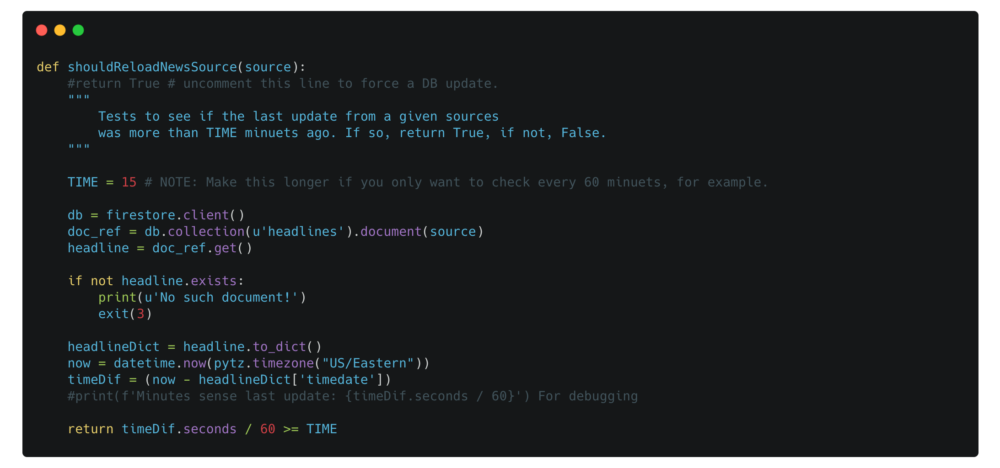

#  headline-vs-headline

Hello! This is a small project I am going to work on to keep my self busy over the holliday break. It is based off of an idea from [this](https://www.youtube.com/watch?v=JTOJsU3FSD8&ab_channel=Fireship) YouTube video.

**Goal:** My goal is to create a site that allows people to see how different media organizations view the world. As a learning oppertunity, I am getting to learn how to preform webscraraping, xPath, and furthering my knowladge on Python & Django.

## Status
Functionality is **done** 😌

##  Usage

In order to use this project, either head over to the **docker** branch, or check out a version of the project [here](https://headline-vs-headline.herokuapp.com/) (Note: The herokuapp is still in development and may take a long time to load, or not load at all.)

##  Project todo list

-  [x] Install and quickstart selenium

- [x] Understand selecting elements with selenium
	- [x] By Class
	- [x] By Id
	- [x] By Xpath

- [x] Implament news sources
	- [x] Fox News
	- [x] MSNBC 
	- [x] New York Times
	- [x] Washington Post

- [x] Begin a Django project to visualize the collected data

- [x] Implament a data base.
	- [x] Choose a data base. SQL? **Firestore?** MongoDB? ect.
	*Firestore DB implamented‼️*

- [x] Write a citation generator. 

- [x] Implament citation generator
	- [x] Fox
	- [x] MSNBC
	- [x] Washington Post
	- [x] New York Times

- [x] Design web interface
- [x] Implament a web interface

- [x] Create docker container
- [x] Write a usage file, requirments.txt, ect.
- [x] Deploy to cloud. Heroku?

### Streach Goals:
- [ ] Add aditional news sites to get data from.
- [ ] Implament an automatic testing program

## License
Please see the included MIT license, and comments describing intentions within the code.

## Contact
Please feel free to contact me via [email](mailto:bacarpenter04@gmail.com)
